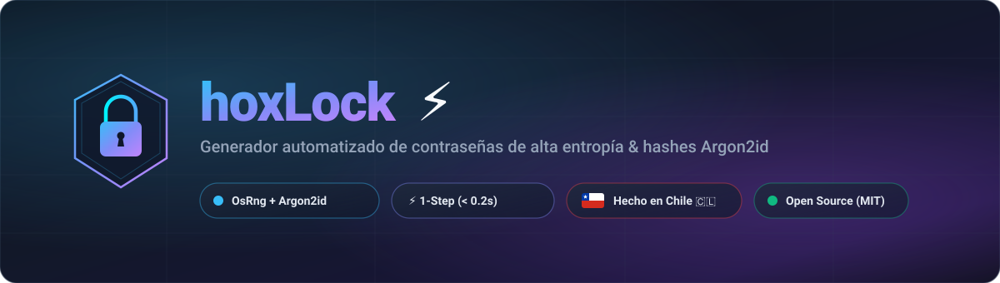

<p align="center">
  
</p>

<p align="center">
  <a href="https://www.rust-lang.org/"></a>
  <a href="https://en.wikipedia.org/wiki/Argon2"></a>
  
  
  <a href="LICENSE"></a>
</p>

<p align="center">
  
</p>

## 🔐 Sobre hoxLock

**hoxLock** es una herramienta de ciberseguridad desarrollada en **Rust** diseñada para la generación inmediata y automatizada de contraseñas de alta entropía criptográfica junto con sus respectivos hashes **Argon2id**. 

Está optimizado para ejecutarse en **un solo paso** sin dependencias en tiempo de ejecución, sin menús interactivos lentos y con tiempo de ejecución directo inferior a **0.2 segundos**.

### ⚡ Características principales

- **Entropía del Kernel (`OsRng`):** Utiliza aleatoriedad criptográficamente segura provista directamente por el sistema operativo.
- **Garantía de caracteres:** Cada contraseña contiene obligatoriamente una combinación de minúsculas, mayúsculas, números y símbolos especiales (`!@#$%^&*()-_=+[]{}:,.?`).
- **Argon2id resistente a GPU/ASIC:** Aplica parámetros de hash de memoria dura recomendados por el RFC 9106 (64 MiB de memoria, 3 pasadas y 1 hilo) con sal criptográfica independiente para cada generación.
- **Automatización instantánea:** El script autocompila si detecta cambios en el código y corre el binario release compilado directamente, eliminando el retardo de resolución de dependencias de Cargo.

---

<p align="center">
  
</p>

## 🚀 Uso Rápido

### Ejecución en 1 Paso

Solo ejecuta el script en la raíz del proyecto:

```bash
./hoxlock
```

> **Nota:** También puedes usar `./generar-contrasena` como comando alternativo retrocompatible.

#### Salida en terminal:
```text
Contraseña: {f(K9%mE4n_R?zT[Ip&d2e]3mZ2_q&I!
Hash Argon2id: $argon2id$v=19$m=65536,t=3,p=1$Qmu7Ue5I1ffA3uvhw4D7Ug$oT8VjCoa8tBKIpIL8Y64bJ39qrIRcr/IT50yWB9/tsw

           /\
          <  >
           \/
           ||
      /\   ||   /\
     <  >==++==<  >
      \/   ||   \/
           ||
           ||
           ||
           ||
          /||\
         /____\
```

### Opciones de línea de comandos

```bash
# Personalizar la longitud (16 a 256 caracteres, por defecto 32)
./hoxlock --longitud 48

# Generar únicamente la contraseña sin procesar el hash Argon2id
./hoxlock --sin-hash

# Ver menú de ayuda
./hoxlock --ayuda
```

---

<p align="center">
  
</p>

## 🧪 Pruebas Unitarias

El proyecto cuenta con suites de tests que validan la entropía, distribución de caracteres y la verificación matemática del hash Argon2id:

```bash
cargo test
```

---

<p align="center">
  
</p>

## 📜 Disclaimer de Open Source & Ciberseguridad

> [!NOTE]
> **Licencia Libre & Auditoría Comunitaria:**  
> **hoxLock** es software de código abierto publicado bajo los términos de la [Licencia MIT](LICENSE). Esto garantiza que el código fuente es 100% auditable, modificable y reutilizable libremente por investigadores, administradores de sistemas y entusiastas de la ciberseguridad.

> [!IMPORTANT]
> **Responsabilidad & Buenas Prácticas:**
> 1. **Gestión segura de credenciales:** Ninguna contraseña es impenetrable por sí sola si el almacenamiento no es adecuado. Guarda siempre tus contraseñas en un gestor de credenciales seguro y confiable.
> 2. **Aislamiento de hashes:** El hash Argon2id se calcula para propósitos de verificación unidireccional y nunca debe almacenarse junto a la contraseña en texto claro.
> 3. **Sin garantías implícitas:** El software se suministra "tal cual" (*as is*), sin garantías de ningún tipo respecto a su idoneidad para entornos particulares. El usuario es el único responsable de la custodia de sus secretos.

---

<p align="center">
  
</p>

## 🇨🇱 Hecho en Chile

Desarrollado con dedicación y enfoque en ingeniería de ciberseguridad desde **Chile 🇨🇱** por [**@hoxtxnDev**](https://github.com/hoxtxnDev).

```text
           /\
          <  >
           \/
           ||
      /\   ||   /\
     <  >==++==<  >
      \/   ||   \/
           ||
           ||
           ||
           ||
          /||\
         /____\
```
